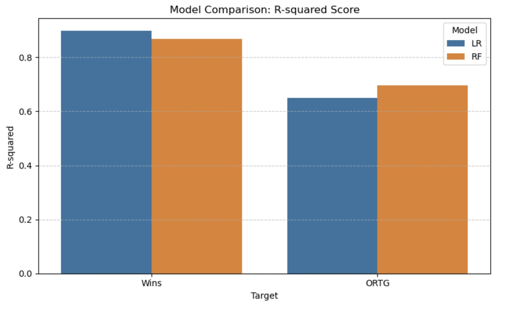
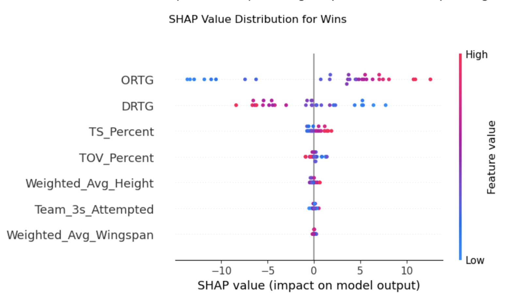
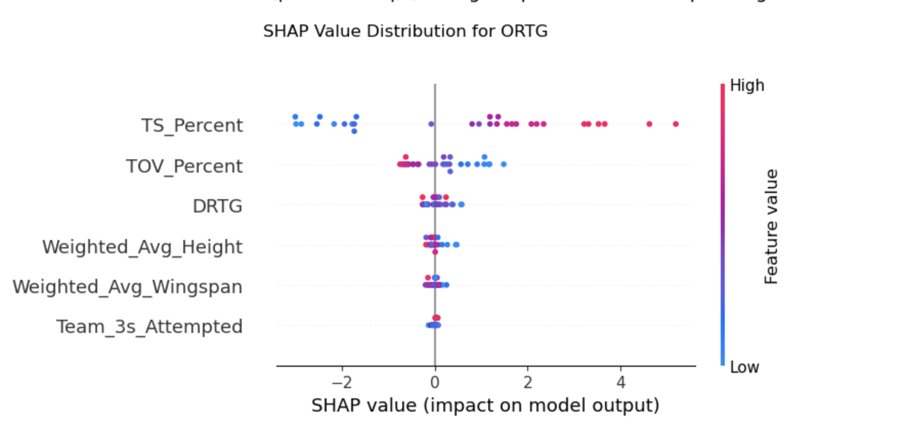
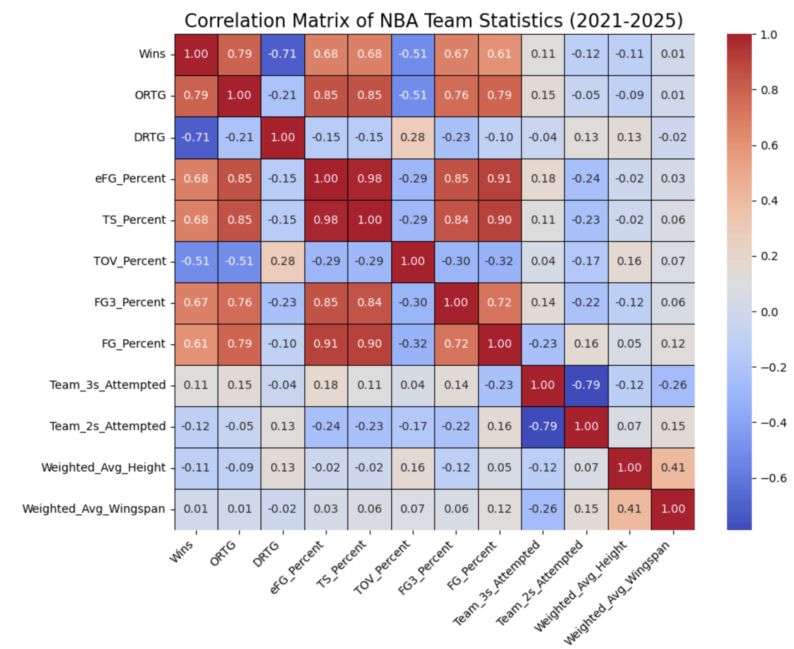

# CMSE 202 Final Project Report: Identifying Key Drivers of NBA Team Wins

**Group Members:** Luka Gjolaj, Kevin Pham, Eric Grenadier, Sahat, Nathan Czopp

**Course:** CMSE 202 Section 4

**Date:** April 21, 2025

## 1. Introduction: The Quest for Winning

The National Basketball Association (NBA) is driven by competition, with teams constantly seeking an edge to maximize victories. Understanding the statistical factors that contribute most significantly to winning is crucial for team building, strategy development, and fan engagement. There are so many ways to win in a game of basketball, with different teams implementing styles that works well for their personnel. This project aims to address the research question: **What key team performance metrics can an NBA team focus on to maximize their chance to win the most games?** We utilized publicly available data accessed via the `nba_api` Python package, focusing on team-level statistics from the 2021-22 season through the 2024-25 season (covering 4 seasons). We got our player heights and wingspans from https://craftednba.com/player-traits/length. Our analysis aims to identify the most impactful statistical drivers of both overall team wins (`Wins`) and offensive efficiency (Offensive Rating - `ORTG`).

## 2. Methods: Modeling Team Performance

**Data Collection & Preparation:** Team statistics (including basic percentages, advanced ratings like `ORTG` and `DRTG`, `TOV_Percent`, and attempt counts) and player minutes were collected via `nba_api`. Player measurement data (height, wingspan) was sourced separately and combined with player minutes to calculate minutes-weighted averages (`Weighted_Avg_Height`, `Weighted_Avg_Wingspan`) for each team per season. A key challenge involved merging measurement data using player names, which required normalization and carries potential for mismatches. Missing numerical values in the final combined dataset were imputed using the overall median value for each column to maintain dataset integrity.

**Feature Selection:** An initial correlation analysis revealed high multicollinearity (>0.9) among several shooting efficiency metrics (`TS%`, `eFG%`, `FG%`, `FG3%`). To mitigate issues in modeling, particularly linear regression, we selected `TS_Percent` as the primary efficiency metric alongside `ORTG`, `DRTG`, `TOV_Percent`, `Team_3s_Attempted`, and the weighted physical measurements for inclusion in our main feature set.

**Computational Techniques:** We employed and compared regression techniques using `scikit-learn` and supporting libraries to predict `Wins` and `ORTG`. Our goal was to assess if more complex models offered performance benefits and to robustly identify key drivers:
* **Linear Regression:** Used as a baseline model to understand linear trends. Features were standardized using `StandardScaler`. Statistical inference (coefficients, p-values) was obtained using `statsmodels` OLS regression on unscaled data.
* **Random Forest Regression:** An ensemble tree-based method chosen for its robustness to non-linearities, ability to handle feature interactions, and built-in feature importance measures.
* **SHAP (SHapley Additive exPlanations):** Utilized via the `shap` library on the trained Random Forest models. SHAP provides detailed, model-agnostic explanations of feature contributions, including the magnitude and direction of impact for each prediction, overcoming some limitations of basic feature importance scores.

**Evaluation & Interpretation:** Model predictive performance was evaluated on a 25% test split using R-squared (R²), Mean Absolute Error (MAE), and Root Mean Squared Error (RMSE). Feature importance was assessed by comparing Random Forest's internal scores and SHAP values. Key Python libraries included `pandas`, `numpy`, `scikit-learn`, `statsmodels`, `shap`, `matplotlib`, and `seaborn`.

## 3. Results: Key Statistical Drivers

**Model Performance:** When predicting `Wins`, Linear Regression slightly outperformed Random Forest (R²: 0.90 vs. 0.87; RMSE: 3.41 vs. 3.90). Conversely, Random Forest demonstrated better predictive accuracy for `ORTG` (R²: 0.70 vs. 0.65; RMSE: 1.58 vs 1.70). This performance difference, illustrated in Figure 1, suggests that while `Wins` can be well explained by linear combinations of key ratings and efficiency, predicting `ORTG` itself benefits from the non-linear relationships captured by Random Forest.

*Figure 1: Comparison of Model Predictive Performance (R² Score).*

**Drivers of Wins (RF/SHAP):** The Random Forest model, interpreted via SHAP analysis, identified `ORTG` (strong positive impact) as the most important driver for `Wins`. Other significant drivers included `DRTG` (surprisingly positive impact - see Discussion), `TS_Percent` (positive impact), `TOV_Percent` (moderate negative impact), and `Weighted_Avg_Height` (slight negative impact). The `statsmodels` linear regression confirmed `ORTG` (positive coefficient, p < 0.05) and `DRTG` (positive coefficient, p < 0.05) as having statistically significant linear relationships with `Wins`. The SHAP analysis provides further detail on these relationships (See Figure 4 placeholder - replace if generated).

*Figure 4 (Example Placeholder): SHAP Summary Plot showing feature impacts on Wins predictions.*

**Drivers of ORTG (RF/SHAP):** For predicting `ORTG`, SHAP analysis highlighted `TS_Percent` as the dominant driver with a strong positive impact (higher efficiency leads to higher rating). `TOV_Percent` showed a clear negative impact (more turnovers hurt offensive rating), while `Weighted_Avg_Height` exhibited a slight negative impact. This indicates that shooting efficiency and ball control are paramount for offensive production in this model. Interestingly, the `statsmodels` linear regression found no predictors with statistically significant p-values (< 0.05) for `ORTG` using this feature set. Figure 3 visualizes the SHAP findings for ORTG.

*Figure 3: SHAP Summary Plot detailing feature impacts on ORTG.*

**Observed Correlations:** The correlation analysis (Figure 2) visually confirmed strong positive linear relationships between efficiency metrics (`TS%`, `eFG%`, etc.) and both `ORTG` and `Wins`. It also clearly showed the high multicollinearity (>0.9) between these shooting percentages, as well as a moderate positive correlation between `Weighted_Avg_Height` and `Weighted_Avg_Wingspan` (0.41).

*Figure 2: Correlation Matrix Heatmap of Team Statistics (2021-2025).*

## 4. Discussion & Difficulties

The analysis provided valuable insights but also faced challenges. The pronounced **multicollinearity** among shooting efficiency metrics, clearly shown in Figure 2, makes isolating the unique contribution of each specific metric difficult, even for Random Forest feature importance. This might also explain the lack of significant predictors for ORTG in the `statsmodels` OLS regression, where standard errors can be inflated by collinear features.

A notable finding was the **counter-intuitive positive relationship between DRTG (lower is better) and Wins** identified by both RF/SHAP and the significant OLS coefficient. While statistically present in this model configuration and dataset, it contradicts general basketball principles. The reason for this is that DRTG is measured as points allowed per 100 possessions. A better defensive team allows less points, meaning a lower DRTG is better. A quick example is a team with a 99.3 DRTG is a much more elite team defensively than a team with a 109.2 DRTG. 
Without knowing what the data actually represents, this might be confusing, but given this information it makes sense. A way to make this more intuitive could be scaling the ratings from 0-100 where 0 is the max DRTG and 100 is the min. This would make the relationship more intuitive, but wouldn't change the model at all.

Data limitations included the **reliance on name-matching** for player measurements, which could introduce noise, and the **four-season timeframe**, limiting the ability to analyze longer-term trends. Finally, it's crucial to remember that these models demonstrate **correlation and predictive importance, not causation**.

## 5. Conclusion

Based on our analysis of NBA team data from the 2021-22 to 2024-25 seasons, maximizing wins appears most strongly linked to achieving a **high Offensive Rating (ORTG)**. This offensive success is, in turn, primarily driven by **high shooting efficiency (specifically TS%)** and **minimizing turnovers (low TOV%)**. While the role of defense (DRTG) was statistically significant in the linear model, its complex and counter-intuitive relationship in the Random Forest/SHAP analysis suggests further study is needed to clarify its impact within this modeling framework. Interestingly, greater team height showed a slight negative association with both Wins and ORTG, perhaps reflecting offensive strategies prevalent during this period. Therefore, to maximize wins according to this analysis, teams should prioritize building efficient offenses centered around accurate shooting and ball security.